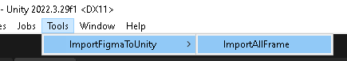

> [!WARNING]
> The ImportFigmaToUnity script is used for personal tasks. Before using it, please read the description of its functionality.

# ImportFigmaToUnity
The ImportFigmaToUnity script is designed to import all frames in a document as separate Canvas files.

## Overview
- Authorization via Token
- To load a document, you need a FileKey
- For each FRAME, a separate Canvas is created with the dimensions of the FRAME, along with the creation of a separate prefab.
- TEXT can be imported as Text or TextMeshPro.
- IMAGES and Shapes can be imported in PNG or JPG format.

### Figma Nodes 
| Node type | Unity |
|---------------------------------|-----------------------------------------------------------------------------------------------------------------------------------------------------|
| GROUP, SECTION, inner FRAME, SLICE | Empty GameObject |
| TEXT | Text, TextMeshPro |
| VECTOR, BOOLEAN_OPERATION, RECTANGLE, LINE, ELLIPSE, REGULAR_POLYGON, STAR  | PNG, JPG|
| Other | Not supported|

## Example

## Install
Download the zip or install via PM → Add package from git URL → `https://github.com/r-set/ImportFigmaToUnity.git?path=/Assets/ImportFigmaToUnity` → Add
## Usage
> [!WARNING]
> Only image import can be aborted; the structure import process does not stop when canceled.
> [Newtonsoft Json](https://github.com/applejag/Newtonsoft.Json-for-Unity) and TextMeshPro packages need to be installed.
1. In Unity, open Window → ImportFigmaToUnity → ImportAllFrames.

2. In the File key field, enter the key from the document URL.

3. In the Token field, enter the Token that can be created in the Figma settings.

4. Select text type and image format.
5. Import the file.
